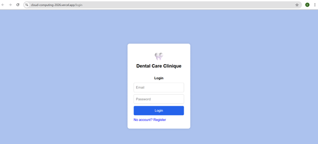
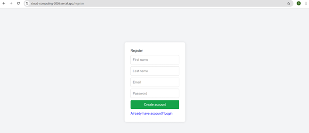
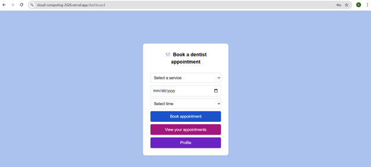
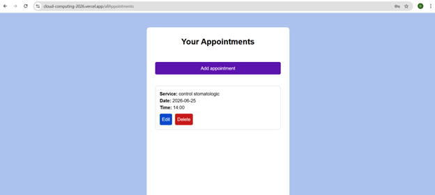
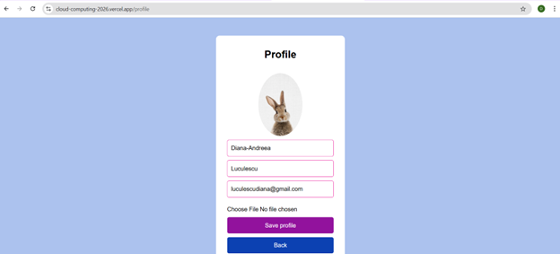

# Proiect Cloud Computing - Dental Care Clinique

### Student: Luculescu Diana-Andreea
**Grupa:** 1146 | **Specializare:** SIMPRE

---

- **Link Publicare:** [https://cloud-computing-2026.vercel.app/](https://cloud-computing-2026.vercel.app/)
- **Link Video Prezentare:** [https://youtu.be/sU0k51sksUU](https://youtu.be/sU0k51sksUU)

---

## 1. Introducere
Pentru acest proiect am dezvoltat o aplicație web full-stack pentru gestionarea programărilor la o clinică stomatologică. Aplicația permite utilizatorilor să își creeze cont, să se autentifice, să realizeze programări online și să își gestioneze profilul personal.

**Tehnologii Cloud utilizate:**
*   **Next.js** (Framework Frontend/Backend)
*   **MongoDB Atlas** (Bază de date Cloud)
*   **Cloudinary** (Stocare imagini profil)
*   **SendGrid** (Serviciu notificări Email)
*   **Vercel** (Hosting și Serverless Functions)

## 2. Descriere problemă
Gestionarea tradițională a programărilor prin telefon sau agendă fizică este ineficientă și predispusă la erori. Aplicația digitalizează acest proces asigurând:
*   **Disponibilitate 24/7** a sistemului.
*   **Persistența datelor** și accesul securizat de pe orice dispozitiv.
*   **Notificări automate** pentru reducerea ratei de neprezentare.

## 3. Descriere API
Aplicația utilizează un API de tip REST construit pe rute serverless.
*   **Bază de date:** MongoDB Atlas pentru stocarea persistenta a datelor.
*   **Stocare Media:** Cloudinary pentru managementul pozelor de profil.
*   **Email:** SendGrid API pentru confirmări automate.
*   **Hosting:** Vercel pentru deployment continuu (CI/CD).

## 4. Flux de date

### Metode HTTP utilizate:

| Metodă | Rută | Descriere |
| :--- | :--- | :--- |
| **POST** | `/api/register` | Crearea unui cont nou cu criptare Bcrypt. |
| **POST** | `/api/login` | Autentificarea utilizatorului și setarea cookie-ului. |
| **POST** | `/api/appointments` | Crearea unei programări și trimitere email. |
| **GET** | `/api/allAppointments` | Preluarea programărilor utilizatorului curent. |
| **PUT** | `/api/profile` | Actualizarea datelor în MongoDB. |
| **POST** | `/api/upload` | Încărcarea imaginii către Cloudinary. |

## 5. Capturi ecran aplicație

### Login

### Register

### Dashboard

### Appointments

### Profile

## 6. Referințe 
1. [Next.js Documentation](https://nextjs.org/docs) 
2. [MongoDB Atlas Guide](https://www.mongodb.com/docs/atlas/) 
3. [Vercel Deployment Docs](https://vercel.com/docs) 
4. [Cloudinary API Reference](https://cloudinary.com/documentation) 
5. [SendGrid Mail Service](https://docs.sendgrid.com/) 
6. [Bcrypt.js Library](https://www.npmjs.com/package/bcryptjs)